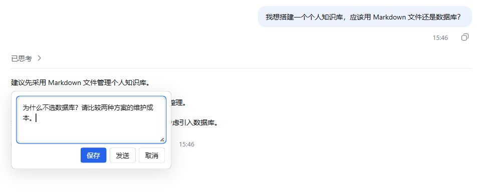

<div align="center">

# Sental DSH Annotation

### 划选 AI 回答，直接说出你的想法。

选中一句话，写下追问、纠正或补充，一键发送。<br>
也可以先批注多处，再集中回复。

**DSH Web** · **v0.1.20** · [**MIT License**](LICENSE)

[快速开始](#快速开始) · [使用方式](#两种回复方式) · [常见问题](#常见问题) · [参与开发](#参与开发)

</div>



<p align="center"><sub>选中一句建议，直接追问：“为什么不选数据库？请比较两种方案的维护成本。”</sub></p>

`sental-dsh-annotation` 是 [DeepSeek Harness（DSH）](https://github.com/deepseek-ai/deepseek-harness) Web 界面的独立批注插件。它让你在阅读 AI 回答时，直接围绕某句话继续讨论，省去复制原文、切换输入框、重新解释引用位置的步骤。

## 两种回复方式

**划选原文 → 点击「批注」→ 写下回复 → 选择保存或发送。**

| 你想做什么             | 点击     | 结果                                                                    |
| ---------------------- | -------- | ----------------------------------------------------------------------- |
| 就这一句话继续讨论     | **发送** | 保存当前批注，将原文和批注一起发送；保留输入框已有草稿和其他引用。      |
| 看完全文后一起回应多处 | **保存** | 保存批注，将新批注引用加入输入框；整理好后，用 DSH 的发送按钮统一提交。 |

所有已保存批注统一保留在输入框上方的 **批注标签页** 中，发送后仍可编辑、删除或加入输入框再次引用。同一段原文可以添加多条独立批注，选区也可以相互重叠。

还支持：

- **回到原文**：已保存批注保留原文高亮，可定位查看。
- **继续整理**：编辑、删除或调整已保存批注的顺序；删除其他条目不会改变现有编号。
- **随手收起**：点击批注区域外部或按 Esc，收起当前详情；未保存的编辑内容会暂留在当前页面。

## 快速开始

### 1. 准备环境

- 已安装并能运行 **DSH Web**。DSH 本身的安装方法见 [上游项目](https://github.com/deepseek-ai/deepseek-harness)。
- **Node.js 24 或更高版本**，也支持 22.19.0 起的 Node.js 22 系列。
- **Git** 和 **pnpm 11.19.0**。

没有 pnpm 时，可先执行：

```sh
npm install -g pnpm@11.19.0
```

本项目通过源码构建安装。

### 2. 下载并构建

```sh
git clone https://github.com/Sental-Hu/sental-dsh-annotation.git
cd sental-dsh-annotation
pnpm install --frozen-lockfile
pnpm build
pnpm pack
```

构建后，当前目录会生成 `sental-dsh-annotation-0.1.20.tgz`。

### 3. 安装到 DSH

在同一目录执行：

```sh
dsh plugin --profile web add ./sental-dsh-annotation-0.1.20.tgz
```

`web` 是安装目标配置；如果你的 DSH 使用其他 profile，请替换为对应名称。安装后重启该 DSH 服务，并刷新浏览器页面。

打开一条 **AI 已完成的普通文本回答**，划选其中一句话。看到「批注」菜单，并能打开带「保存 / 发送」按钮的弹窗，即可开始使用。

<details>
<summary>提示找不到 dsh 命令？</summary>

先确认当前终端能够运行 DSH。如果你是从 DSH 源码启动的，可以将上面的 `dsh` 替换成自己平时使用的 CLI 启动命令，例如：

```sh
node /path/to/deepseek-harness/apps/cli/lib/bin.js plugin --profile web add /path/to/sental-dsh-annotation-0.1.20.tgz
```

请使用实际路径；路径含空格时加双引号。

</details>

### 从旧版 dsh-annotation 升级

先备份 DSH 数据目录，再移除旧包并安装新包，避免两个版本同时加载：

```sh
dsh plugin --profile web remove dsh-annotation
dsh plugin --profile web add ./sental-dsh-annotation-0.1.20.tgz
```

新版本保留批注存储及引用格式，已有批注可继续使用。使用启动器管理插件时，安装后重新检查并保存插件选择，再启动 DSH。

## 支持范围

插件安装在 **DSH 中**，通过浏览器使用。

| 环境                                     | 状态                                                     |
| ---------------------------------------- | -------------------------------------------------------- |
| Windows + Edge + DSH 0.1.5-rc.1 本地构建 | 已完成安装、保存、直接发送和刷新恢复验证。               |
| DSH 0.1.0-rc.8                           | 旧版持久化协议有回归测试覆盖；不等同于完整界面验收。     |
| macOS / Linux                            | 共用同一插件包，尚未完成对应系统实测。                   |
| iPhone / iPad                            | 可通过浏览器访问已运行的 DSH；触摸交互尚未完成真机验证。 |

支持同一回答中的普通文本及相邻普通段落。代码块、表格、工具输出、思考内容和跨消息选区不支持批注。

更详细的环境和测试结果见 [安装验证记录](docs/installation-verification.md)。DSH 接口仍在迭代，升级宿主后请检查插件是否正常加载；缺少直接发送接口时，「发送」按钮会禁用。

## 常见问题

<details>
<summary><strong>批注保存在哪里？需要另外配置模型吗？</strong></summary>

批注保存在运行 DSH 的电脑或服务器上；会话有可写工作区时，还会生成 `.dsh/annotations/` 下的 Markdown 历史文件。

插件使用当前 DSH 会话及其模型配置，不需要单独配置模型。点击发送后，选中的原文和批注会随当前会话提交给你配置的模型。

</details>

<details>
<summary><strong>刷新后，输入框里的引用变成了「[批注 3]」怎么办？</strong></summary>

批注记录仍然保留，但 DSH 恢复的输入草稿可能只剩文字标签。打开对应批注卡片，核对内容后点击「恢复引用」。如果存在重复标签，先清理重复项。

</details>

<details>
<summary><strong>出现「核对发送」是什么意思？</strong></summary>

发送结果尚未得到确认，批注会继续保留。先检查当前对话，再点击「核对发送」检查已有提交记录；这个操作不会重新发送，避免出现重复消息。

</details>

<details>
<summary><strong>怎样卸载？会删除批注吗？</strong></summary>

```sh
dsh plugin --profile web remove sental-dsh-annotation
```

重启 DSH 并刷新页面后生效。卸载插件会保留已有批注数据。

</details>

<details>
<summary><strong>可以用于其他 AI 聊天客户端吗？</strong></summary>

目前支持 DSH Web，不能直接安装到 Codex、OpenCode、WorkBuddy 或 Qoder 等其他客户端。

</details>

## 参与开发

欢迎通过 [Issues](https://github.com/Sental-Hu/sental-dsh-annotation/issues) 反馈问题或提出建议。报告问题时，请附上插件版本、DSH 版本、操作系统、浏览器及复现步骤。

```sh
pnpm lint
pnpm typecheck
pnpm test
pnpm build
pnpm pack:check
```

- [架构与模块说明](DESIGN.md)
- [安装验证记录](docs/installation-verification.md)
- [源代码](src/)

## 许可证

[MIT](LICENSE) · sental-dsh-annotation contributors
